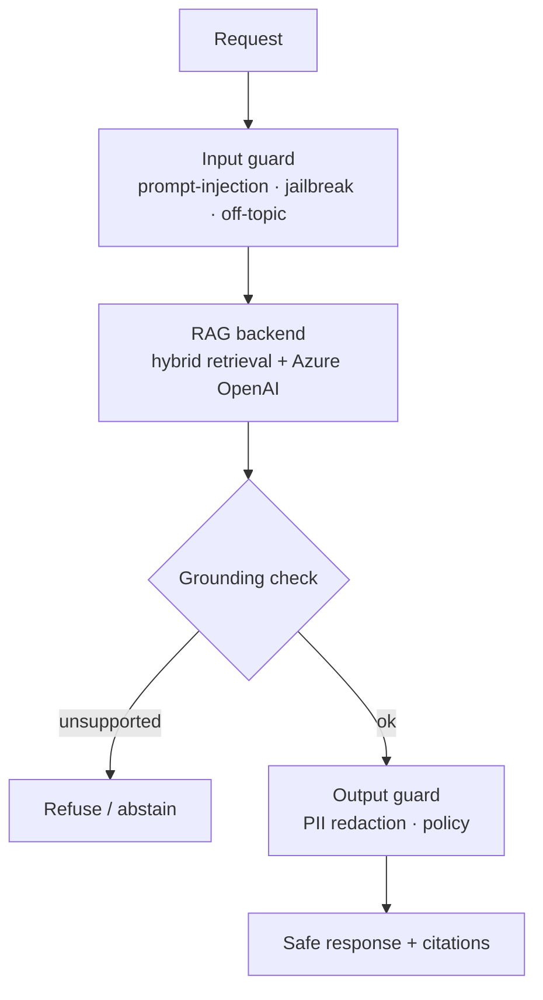

# LLM Guardrails — PII Redaction & Prompt-Injection Defense for RAG

> Reusable **guardrail middleware** for RAG/LLM services: grounding & hallucination checks (refuse when unsupported), PII detection & redaction, and prompt-injection defense — drop-in for any FastAPI RAG backend.

   


---

## Why this exists

The gap between a demo and a deployable enterprise RAG is safety: does it refuse when it lacks evidence, redact PII, and resist prompt injection? This repo extracts those controls into middleware you can wrap around any RAG service.

## Architecture



## Status
- **Implemented:** a production-shaped RAG backend (Microsoft Agent Framework, hybrid BM25+vector, managed identity, **confidence/score-first gate**, citation-from-retrieval only).
- **Focus (this repo):** package the guardrails as standalone middleware — grounding/faithfulness check, PII redaction (Presidio), input/output filters — usable by any of the other RAG services.

## Quickstart
```bash
cp .env.example .env
pip install -r requirements.txt
uvicorn app.main:app --reload   # /chat, /chat/stream with guards applied
```

## Roadmap
- Pluggable policy config; NeMo Guardrails / LLM Guard integration.
- Metrics: refusal rate, injection-block rate, redaction counts.

---
